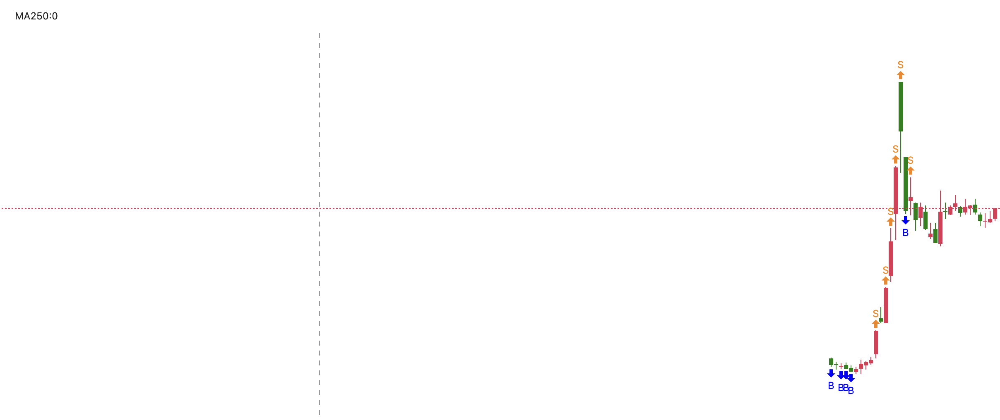

# Markdown syntax guide

[[toc]]

## Headers

> [!IMPORTANT]
>
> asdfasdfasdfas


# This is a Heading h1 <Badge type="danger" text="test" />
## This is a Heading h2




###### This is a Heading h6

> [!NOTE]
> 强调用户在快速浏览文档时也不应忽略的重要信息。

> [!TIP]
> 有助于用户更顺利达成目标的建议性信息。

> [!IMPORTANT]
> 对用户达成目标至关重要的信息。

> [!WARNING]
> 因为可能存在风险，所以需要用户立即关注的关键内容。

> [!CAUTION]
> 行为可能带来的负面影响。

::: danger STOP
危险区域，请勿继续
:::

::: details 点我查看代码
```js
console.log('Hello, VitePress!')
```
:::

::: info
This is an info box.
:::

::: tip
This is a tip.
:::

::: warning
This is a warning.
:::

::: danger
This is a dangerous warning.
:::

::: details
This is a details block.
:::

:tada: :100:

{{ 1 + 1 }}

<script setup>
import { ref } from 'vue'

const count = ref(0)
</script>

## Markdown Content

The count is: {{ count }}

<button :class="$style.button" @click="count++">这是一个+1按钮</button>

<style module>
.button {
  color: red;
  font-weight: bold;
}
</style>

## Emphasis

*This text will be italic*  
_This will also be italic_

**This text will be bold**  
__This will also be bold__

_You **can** combine them_

## Lists

### Unordered

* Item 1
* Item 2
* Item 2a
* Item 2b

### Ordered

1. Item 1
2. Item 2
3. Item 3
    1. Item 3a
    2. Item 3b

## Images

## Links

You may be using [Markdown Live Preview](https://markdownlivepreview.com/).

## Blockquotes

> Markdown is a lightweight markup language with plain-text-formatting syntax, created in 2004 by John Gruber with Aaron Swartz.
>
> > Markdown is often used to format readme files, for writing messages in online discussion forums, and to create rich text using a plain text editor.

## Tables

| Left columns | Right columns |
| ------------ | :-----------: |
| left foo     |   right foo   |
| left bar     |   right bar   |
| left baz     |   right baz   |

## Blocks of code

```
let message = 'Hello world';
alert(message);
```

## Inline code

This web site is using `markedjs/marked`.
