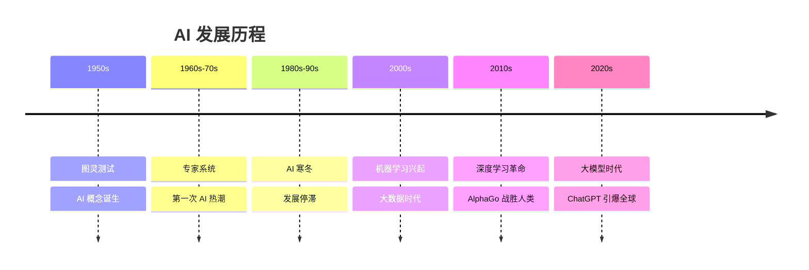

# AI 发展历史

## 时间线概览

## 萌芽期（1950-1956）

### 图灵测试（1950）

艾伦·图灵发表论文《计算机器与智能》，提出著名的"图灵测试"：

> 如果一台机器能够与人类展开对话而不被辨别出其机器身份，那么这台机器就具有智能。

### 达特茅斯会议（1956）

- 标志着 AI 作为一门学科正式诞生
- 约翰·麦卡锡首次提出"人工智能"这个术语
- 参与者：马文·明斯基、克劳德·香农等

## 第一次繁荣期（1956-1974）

### 主要成就

- **1957**：感知机（Perceptron）诞生
- **1966**：ELIZA 聊天机器人
- **1969**：专家系统开始发展

### 乐观预期

当时研究者认为：
- 20 年内机器将能完成人类的所有工作
- 机器翻译即将实现

## 第一次 AI 寒冬（1974-1980）

### 遇到的问题

- 计算能力不足
- 数据量有限
- 理论突破缓慢
- 资金支持减少

::: warning 历史教训
过度承诺和未能兑现导致了信任危机，这提醒我们要对 AI 的能力保持理性认识。
:::

## 专家系统时代（1980-1987）

### 复兴的标志

- **XCON 系统**：为 DEC 公司节省数千万美元
- 日本的"第五代计算机"计划
- 专家系统商业化成功

### 代表性系统

- MYCIN：医疗诊断
- DENDRAL：化学分析
- XCON：计算机配置

## 第二次 AI 寒冬（1987-1993）

### 衰退原因

- 专家系统维护成本高
- 难以扩展和更新
- 个人电脑兴起，专用硬件失去优势

## 机器学习崛起（1993-2011）

### 关键转折

- **1997**：IBM 深蓝击败国际象棋冠军卡斯帕罗夫
- **2006**：Geoffrey Hinton 提出深度学习
- 互联网带来海量数据
- GPU 提供强大算力

### 技术进步

- 支持向量机（SVM）
- 随机森林
- 神经网络复兴

## 深度学习革命（2012-2020）

### 里程碑事件

#### 2012：ImageNet 突破
- AlexNet 在图像识别竞赛中大幅领先
- 深度学习开始主导 AI 领域

#### 2016：AlphaGo 战胜李世石
- 围棋被认为是 AI 最难攻克的领域
- 展示了深度强化学习的威力

#### 2017：Transformer 架构
- Google 提出 Transformer
- 为大语言模型奠定基础

#### 2018：BERT 模型
- 自然语言处理取得重大突破
- 预训练模型成为主流

### 技术特点

- 端到端学习
- 大规模数据训练
- GPU/TPU 加速
- 迁移学习

## 大模型时代（2020-至今）

### GPT 系列

- **2020**：GPT-3（1750 亿参数）
- **2022**：ChatGPT 发布，用户破亿
- **2023**：GPT-4 多模态能力

### 多模态 AI

- DALL-E：文本生成图像
- Midjourney：AI 绘画
- Sora：文本生成视频

### 开源运动

- Meta 的 LLaMA 系列
- Stable Diffusion
- 中国的通义千问、文心一言

## 发展趋势

### 当前热点

1. **大语言模型（LLM）**
   - 参数规模持续增长
   - 能力不断提升

2. **多模态融合**
   - 文本、图像、音频、视频统一处理

3. **AI Agent**
   - 自主规划和执行任务
   - 工具使用能力

4. **边缘 AI**
   - 模型压缩和优化
   - 设备端部署

### 未来展望

- 🔮 **通用人工智能（AGI）**：仍在探索中
- 🤝 **人机协作**：AI 作为助手而非替代
- 🛡️ **AI 安全**：对齐、可控、可解释
- ⚖️ **AI 伦理**：公平、隐私、责任

## 关键人物

| 人物 | 贡献 | 时期 |
|------|------|------|
| 艾伦·图灵 | 图灵测试 | 1950s |
| 约翰·麦卡锡 | AI 之父 | 1950s |
| Geoffrey Hinton | 深度学习先驱 | 2000s |
| Yann LeCun | CNN 发明者 | 1990s |
| Yoshua Bengio | 深度学习三巨头 | 2000s |
| 李飞飞 | ImageNet 创建者 | 2000s |
| Sam Altman | OpenAI CEO | 2020s |

## 重要启示

::: tip 历史规律
1. **技术周期**：AI 发展并非一帆风顺，经历多次起伏
2. **基础设施**：算力和数据是 AI 发展的关键
3. **应用驱动**：实际应用价值决定技术能否持续发展
4. **理性预期**：避免过度炒作，关注实际进展
:::

## 下一步

- [AI 应用场景](/basics/applications) - 了解 AI 的实际应用
- [数学基础](/basics/math-foundation) - 学习 AI 所需数学知识
- [机器学习简介](/machine-learning/introduction) - 深入学习核心技术
