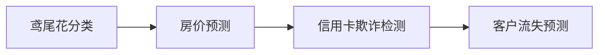
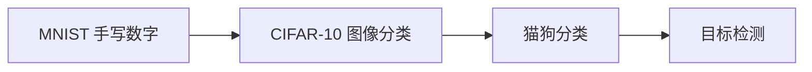
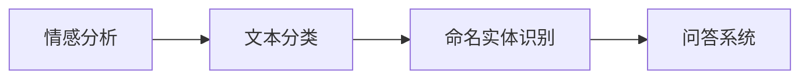

# 实战项目概览

通过实际项目巩固 AI 知识，从理论走向实践。

## 项目分类

### 按难度分类

| 难度 | 特点 | 适合人群 | 项目示例 |
|------|------|----------|----------|
| 🟢 入门 | 数据简单、算法基础 | 初学者 | 鸢尾花分类、房价预测 |
| 🟡 中级 | 需要特征工程、模型调优 | 有基础 | 图像分类、情感分析 |
| 🔴 高级 | 复杂架构、大规模数据 | 进阶者 | 目标检测、对话系统 |

### 按领域分类

- 🖼️ **计算机视觉**：图像分类、目标检测、图像生成
- 💬 **自然语言处理**：文本分类、机器翻译、问答系统
- 📊 **数据分析**：预测模型、推荐系统、异常检测
- 🎮 **强化学习**：游戏 AI、机器人控制
- 🎵 **音频处理**：语音识别、音乐生成

## 推荐学习路径

### 路径 1：机器学习入门



### 路径 2：深度学习



### 路径 3：NLP 应用



## 项目列表

### 🟢 入门项目

#### 1. 鸢尾花分类
- **目标**：根据花瓣特征分类鸢尾花品种
- **数据**：150 个样本，4 个特征
- **算法**：KNN、决策树、逻辑回归
- **时间**：2-3 小时

```python
from sklearn.datasets import load_iris
from sklearn.model_selection import train_test_split
from sklearn.neighbors import KNeighborsClassifier
from sklearn.metrics import accuracy_score

# 加载数据
iris = load_iris()
X_train, X_test, y_train, y_test = train_test_split(
    iris.data, iris.target, test_size=0.2, random_state=42
)

# 训练模型
knn = KNeighborsClassifier(n_neighbors=3)
knn.fit(X_train, y_train)

# 评估
y_pred = knn.predict(X_test)
print(f"准确率: {accuracy_score(y_test, y_pred):.2%}")
```

#### 2. 房价预测
- **目标**：预测房屋价格
- **数据**：波士顿房价数据集
- **算法**：线性回归、随机森林
- **时间**：3-4 小时

#### 3. 泰坦尼克生存预测
- **目标**：预测乘客是否生还
- **数据**：Kaggle 泰坦尼克数据集
- **技能**：数据清洗、特征工程
- **时间**：4-6 小时

### 🟡 中级项目

#### 1. 图像分类器
- **目标**：识别图像中的物体
- **数据**：CIFAR-10（60000 张图片）
- **技术**：CNN、数据增强、迁移学习
- **时间**：1-2 天

```python
import torch
import torch.nn as nn
import torchvision
import torchvision.transforms as transforms

# 数据预处理
transform = transforms.Compose([
    transforms.RandomHorizontalFlip(),
    transforms.RandomCrop(32, padding=4),
    transforms.ToTensor(),
    transforms.Normalize((0.5, 0.5, 0.5), (0.5, 0.5, 0.5))
])

# 加载数据
trainset = torchvision.datasets.CIFAR10(
    root='./data', train=True, download=True, transform=transform
)
trainloader = torch.utils.data.DataLoader(
    trainset, batch_size=128, shuffle=True
)

# 定义模型
class SimpleCNN(nn.Module):
    def __init__(self):
        super(SimpleCNN, self).__init__()
        self.conv1 = nn.Conv2d(3, 32, 3, padding=1)
        self.conv2 = nn.Conv2d(32, 64, 3, padding=1)
        self.pool = nn.MaxPool2d(2, 2)
        self.fc1 = nn.Linear(64 * 8 * 8, 512)
        self.fc2 = nn.Linear(512, 10)
        self.dropout = nn.Dropout(0.5)
    
    def forward(self, x):
        x = self.pool(torch.relu(self.conv1(x)))
        x = self.pool(torch.relu(self.conv2(x)))
        x = x.view(-1, 64 * 8 * 8)
        x = self.dropout(torch.relu(self.fc1(x)))
        x = self.fc2(x)
        return x

model = SimpleCNN()
```

#### 2. 情感分析
- **目标**：判断评论的情感倾向
- **数据**：IMDB 电影评论
- **技术**：LSTM、BERT 微调
- **时间**：2-3 天

#### 3. 推荐系统
- **目标**：推荐用户可能喜欢的商品
- **数据**：MovieLens 电影评分
- **技术**：协同过滤、矩阵分解
- **时间**：2-3 天

### 🔴 高级项目

#### 1. 聊天机器人
- **目标**：构建对话系统
- **技术**：Transformer、RAG、LangChain
- **时间**：1-2 周

#### 2. 目标检测
- **目标**：检测图像中的多个物体
- **数据**：COCO 数据集
- **技术**：YOLO、Faster R-CNN
- **时间**：1-2 周

#### 3. 文本生成应用
- **目标**：自动生成文章或代码
- **技术**：GPT 微调、提示工程
- **时间**：1-2 周

## 项目开发流程

### 1. 问题定义
```markdown
- 目标是什么？
- 成功的标准是什么？
- 有哪些约束条件？
```

### 2. 数据收集
```python
# 数据来源
- 公开数据集（Kaggle, UCI, Hugging Face）
- 爬虫采集
- API 获取
- 自己标注
```

### 3. 数据探索
```python
import pandas as pd
import matplotlib.pyplot as plt
import seaborn as sns

# 加载数据
df = pd.read_csv('data.csv')

# 基本信息
print(df.info())
print(df.describe())

# 可视化
sns.pairplot(df)
plt.show()
```

### 4. 数据预处理
```python
# 处理缺失值
df = df.fillna(df.mean())

# 处理异常值
Q1 = df.quantile(0.25)
Q3 = df.quantile(0.75)
IQR = Q3 - Q1
df = df[~((df < (Q1 - 1.5 * IQR)) | (df > (Q3 + 1.5 * IQR))).any(axis=1)]

# 特征缩放
from sklearn.preprocessing import StandardScaler
scaler = StandardScaler()
df_scaled = scaler.fit_transform(df)
```

### 5. 模型训练
```python
from sklearn.model_selection import cross_val_score

# 尝试多个模型
models = {
    'Logistic Regression': LogisticRegression(),
    'Random Forest': RandomForestClassifier(),
    'XGBoost': XGBClassifier()
}

for name, model in models.items():
    scores = cross_val_score(model, X, y, cv=5)
    print(f"{name}: {scores.mean():.3f} (+/- {scores.std():.3f})")
```

### 6. 模型评估
```python
from sklearn.metrics import classification_report, confusion_matrix

# 预测
y_pred = model.predict(X_test)

# 评估
print(classification_report(y_test, y_pred))
print(confusion_matrix(y_test, y_pred))
```

### 7. 模型优化
```python
from sklearn.model_selection import GridSearchCV

# 超参数搜索
param_grid = {
    'n_estimators': [100, 200, 300],
    'max_depth': [10, 20, 30],
    'min_samples_split': [2, 5, 10]
}

grid_search = GridSearchCV(
    RandomForestClassifier(),
    param_grid,
    cv=5,
    scoring='accuracy'
)

grid_search.fit(X_train, y_train)
print(f"最佳参数: {grid_search.best_params_}")
```

### 8. 部署
```python
import joblib

# 保存模型
joblib.dump(model, 'model.pkl')

# 创建 API
from flask import Flask, request, jsonify

app = Flask(__name__)
model = joblib.load('model.pkl')

@app.route('/predict', methods=['POST'])
def predict():
    data = request.json
    prediction = model.predict([data['features']])
    return jsonify({'prediction': int(prediction[0])})

if __name__ == '__main__':
    app.run(debug=True)
```

## 数据集资源

### 通用数据集

| 平台 | 特点 | 链接 |
|------|------|------|
| Kaggle | 竞赛数据、社区活跃 | kaggle.com/datasets |
| UCI | 经典数据集 | archive.ics.uci.edu/ml |
| Hugging Face | NLP 数据集 | huggingface.co/datasets |
| Google Dataset Search | 搜索引擎 | datasetsearch.research.google.com |

### 领域数据集

**计算机视觉**
- ImageNet：图像分类
- COCO：目标检测
- CelebA：人脸属性

**自然语言处理**
- GLUE：文本理解
- SQuAD：问答
- WikiText：语言模型

**推荐系统**
- MovieLens：电影评分
- Amazon Reviews：商品评论

## 工具和框架

### 机器学习
```python
# Scikit-learn：经典算法
from sklearn import *

# XGBoost：梯度提升
import xgboost as xgb

# LightGBM：高效梯度提升
import lightgbm as lgb
```

### 深度学习
```python
# PyTorch：灵活的深度学习框架
import torch
import torch.nn as nn

# TensorFlow/Keras：易用的框架
import tensorflow as tf
from tensorflow import keras

# Hugging Face：预训练模型
from transformers import AutoModel, AutoTokenizer
```

### 数据处理
```python
# Pandas：数据分析
import pandas as pd

# NumPy：数值计算
import numpy as np

# Polars：高性能数据处理
import polars as pl
```

### 可视化
```python
# Matplotlib：基础绘图
import matplotlib.pyplot as plt

# Seaborn：统计可视化
import seaborn as sns

# Plotly：交互式图表
import plotly.express as px
```

## 最佳实践

### 项目结构
```
project/
├── data/
│   ├── raw/              # 原始数据
│   ├── processed/        # 处理后的数据
│   └── external/         # 外部数据
├── notebooks/            # Jupyter notebooks
├── src/
│   ├── data/            # 数据处理
│   ├── features/        # 特征工程
│   ├── models/          # 模型定义
│   └── visualization/   # 可视化
├── models/              # 保存的模型
├── reports/             # 报告和图表
├── requirements.txt     # 依赖
└── README.md           # 项目说明
```

### 版本控制
```bash
# Git 忽略文件
echo "data/
models/
*.pyc
__pycache__/
.ipynb_checkpoints/" > .gitignore

# 提交代码
git add .
git commit -m "Initial commit"
```

### 实验管理
```python
# 使用 MLflow 跟踪实验
import mlflow

mlflow.start_run()
mlflow.log_param("learning_rate", 0.01)
mlflow.log_metric("accuracy", 0.95)
mlflow.log_artifact("model.pkl")
mlflow.end_run()
```

## 学习建议

::: tip 成功秘诀
1. **从简单开始**：不要一开始就挑战复杂项目
2. **完整走完流程**：从数据到部署，体验完整流程
3. **记录和总结**：写博客、做笔记
4. **参考优秀项目**：学习他人的代码和思路
5. **参加竞赛**：Kaggle 是很好的实践平台
6. **持续迭代**：不断优化和改进
:::

## 常见问题

### Q: 数据不够怎么办？
- 数据增强
- 迁移学习
- 使用预训练模型
- 合成数据

### Q: 模型效果不好？
- 检查数据质量
- 尝试不同算法
- 特征工程
- 超参数调优
- 集成学习

### Q: 如何展示项目？
- GitHub 仓库
- 技术博客
- 在线 Demo
- 视频演示

## 下一步

选择一个项目开始实践：

- [图像分类器](/projects/image-classifier) - 计算机视觉入门
- [聊天机器人](/projects/chatbot) - NLP 应用
- [文本生成应用](/projects/text-generation) - LLM 实战
- [推荐系统](/projects/recommendation-system) - 数据挖掘

动手实践是最好的学习方式，开始你的第一个项目吧！
